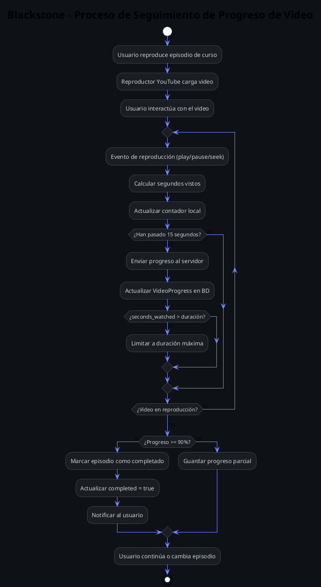

# BPMN - Seguimiento de Progreso de Video

## Diagrama

## Descripción del proceso

Este diagrama modela el sistema de seguimiento de progreso de videos:

1. **Reproducción**: El usuario inicia un episodio de curso
2. **Monitoreo continuo**: Eventos de play/pause/seek se monitorean
3. **Auto-guardado**: Cada 15 segundos se envía progreso al servidor
4. **Validación**: Se previene abuso limitando seconds_watched a la duración máxima
5. **Completado**: Al alcanzar 90% se marca como completado

## Componentes técnicos

- `video_player_controller.js` - Stimulus controller para YouTube API
- `VideoProgress` model - Almacena progreso por usuario y episodio
- `video_progresses_controller.rb` - Endpoint para guardar progreso
