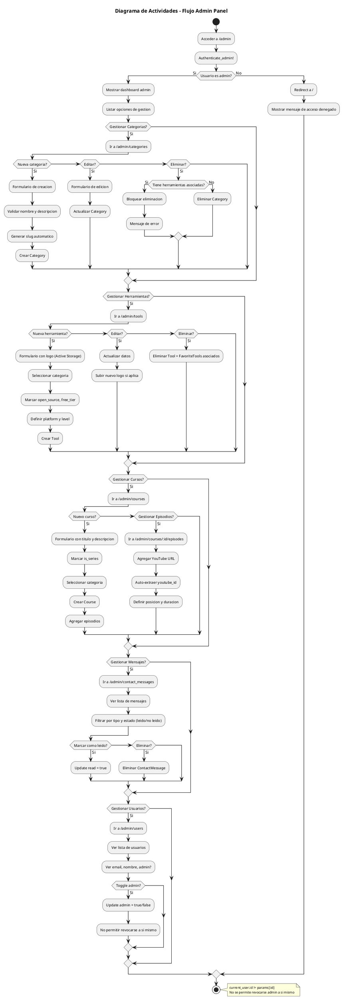

# Diagrama de Actividades - Flujo Admin Panel

## Flujo del Administrador

### 1. Autenticacion
1. Admin accede a /admin
2. Sistema verifica authenticate_user!
3. Sistema verifica authenticate_admin!
4. Si no es admin -> redirect con error

### 2. Gestion de Categorias (CRUD)
- **Crear**: Nombre, descripcion -> slug auto-generado
- **Editar**: Modificar datos existentes
- **Eliminar**: Bloqueado si tiene herramientas asociadas

### 3. Gestion de Herramientas (CRUD)
- **Crear**: Formulario completo con logo (Active Storage)
- **Editar**: Actualizar cualquier campo
- **Eliminar**: CASCADE elimina favoritos asociados

### 4. Gestion de Cursos (CRUD)
- **Crear**: Titulo, descripcion, is_series, categoria
- **Gestionar Episodios**: YouTube URL -> auto-extrae youtube_id
- **Eliminar**: CASCADE elimina episodios

### 5. Gestion de Mensajes
- **Ver**: Lista filtrable por tipo y estado
- **Marcar leido**: Update read = true
- **Eliminar**: Eliminacion directa

### 6. Gestion de Usuarios
- **Ver**: Lista de usuarios con email, nombre, rol
- **Toggle Admin**: Cambiar admin de otros usuarios
- **Restriccion**: No puede revocarse admin a si mismo
