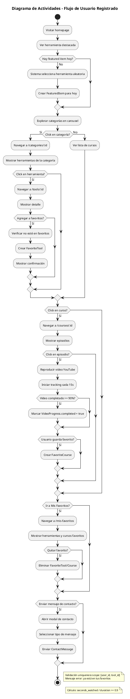

# Diagrama de Actividades - Flujo de Usuario Registrado

## Flujo de Usuario Registrado

### 1. Home y Descubrimiento
1. Usuario visita homepage
2. Sistema verifica si hay featured item para hoy
3. Si no hay, selecciona herramienta aleatoria
4. Usuario explora categorías en carousel

### 2. Exploración de Herramientas
1. Click en categoría → lista herramientas
2. Click en herramienta → detalle
3. Opcional: agregar a favoritos

### 3. Cursos y Progreso
1. Usuario selecciona curso
2. Ve lista de episodios
3. Reproduce episodio
4. Sistema guarda progreso cada 15s
5. Si >= 90%, marca como completado

### 4. Favoritos
1. Usuario accede a `/mis-favoritos`
2. Ve herramientas y cursos guardados
3. Puede eliminar favoritos

### 5. Contacto
1. Abre modal de contacto
2. Selecciona tipo de mensaje
3. Envía mensaje al admin
