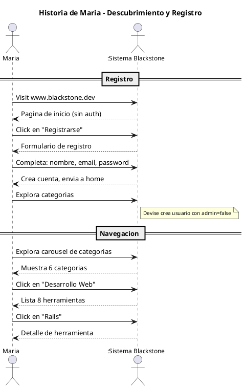
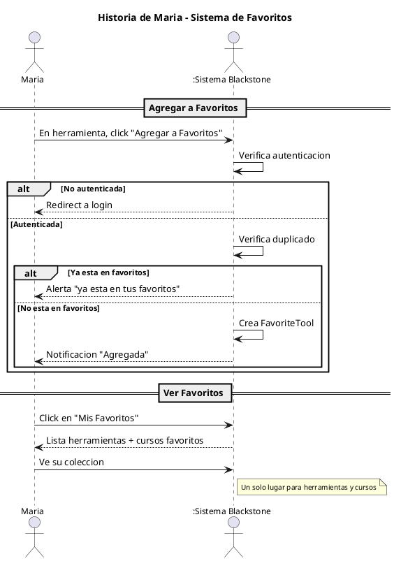
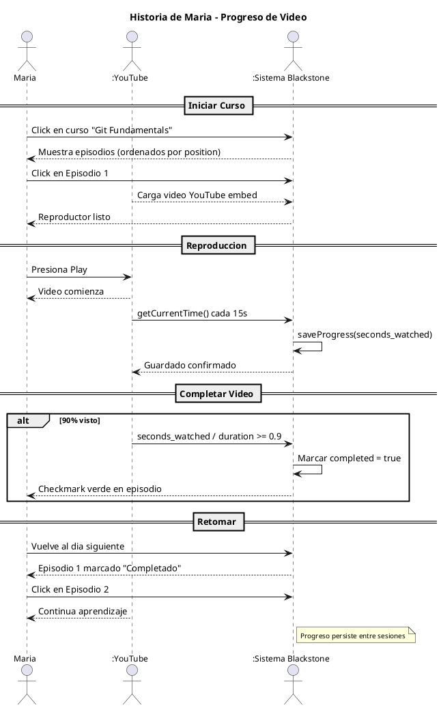
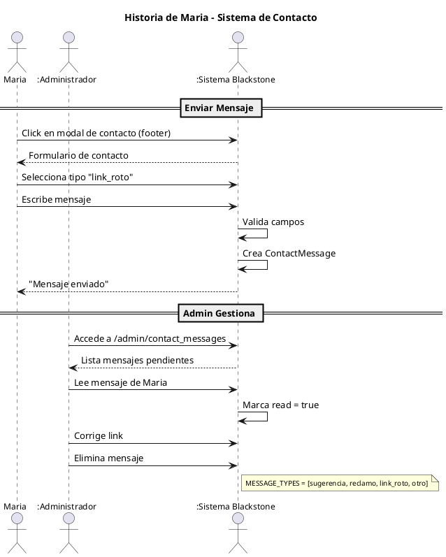

# Diagrama de Casos de Uso Narrativo - Historia de Usuario

## Historia: El Estudiante y los Favoritos

### Narrativa

> **Maria**, estudiante de 22 anos, quiere organizar su aprendizaje.
> Un dia descubre **Blackstone** mientras busca herramientas para programar.
> Se registra, explora categorias, guarda favoritos y sigue un curso de Ruby.
> Esta es su historia.

---

### Actor Principal

| Actor | Descripcion |
|-------|-------------|
| **Maria** | Estudiante universitaria de Ingenieria en Sistemas, 22 anos |

### Actores Secundarios

| Actor | Descripcion |
|-------|-------------|
| **Sistema Blackstone** | La plataforma que provee contenido y funcionalidades |
| **YouTube** | Servidor externo que provee los videos de los cursos |

---

## Caso de Uso: Descubrimiento y Registro

### Narrativa Simple

```
Maria estaba buscando herramientas para aprender Ruby on Rails.
 encontro Blackstone en Google y decidio probarlo.
 Se registro con su email y comenzo a explorar.
```

### Diagrama de Actores



---

## Caso de Uso: Agregar a Favoritos

### Narrativa Simple

```
Maria encontro una herramienta que le gusto.
 La agregue a favoritos para no olvidarla.
 Ahora puede verla anytime en "Mis Favoritos".
```

### Diagrama de Actores



---

## Caso de Uso: Seguir un Curso

### Narrativa Simple

```
Maria encontro un curso de Git en video.
 Lo vio por 20 minutos (se guardo progreso).
 Al dia siguiente, retomo donde quedo.
 Completion al 90%, video marcado como completado.
```

### Diagrama de Actores



---

## Caso de Uso: Feedback

### Narrativa Simple

```
Maria encontro un link roto en una herramienta.
 Abrio el modal de contacto en el footer.
 Selecciono "link_roto" y envio el mensaje.
 El admin lo recibio y lo corrigio.
```

### Diagrama de Actores



---

## Resumen de Historia

| Etapa | Actor | Accion | Resultado |
|-------|-------|--------|-----------|
| 1. Descubrimiento | Maria | Se registra | Cuenta creada |
| 2. Exploracion | Maria | Navega categorias | Encuentra herramientas |
| 3. Favoritos | Maria | Agrega herramienta | Guardada en favoritos |
| 4. Aprendizaje | Maria + YouTube | Ve video curso | Progreso guardado |
| 5. Feedback | Maria | Reporta link roto | Admin corrige |

---

## Lecciones Aprendidas

1. **Autenticacion**: Devise maneja registro/login transparently
2. **Favoritos**: Uniqueness constraint previene duplicados
3. **Progreso**: Auto-save cada 15s permite retomar luego
4. **Feedback**: Sistema de contacto mejora calidad del contenido
