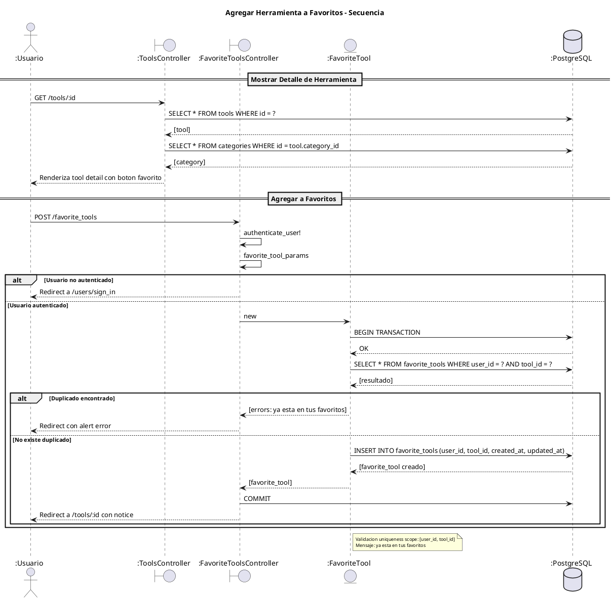
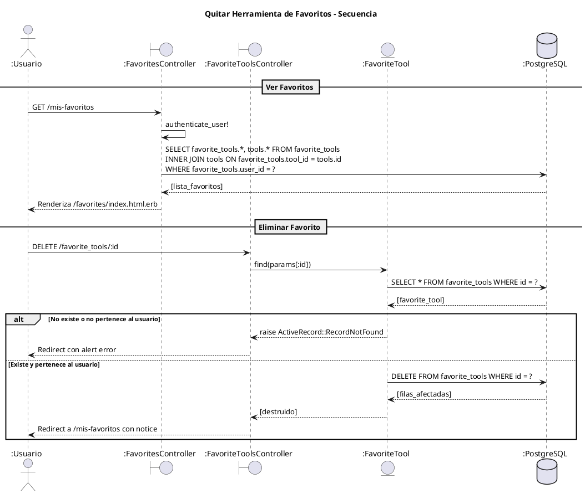
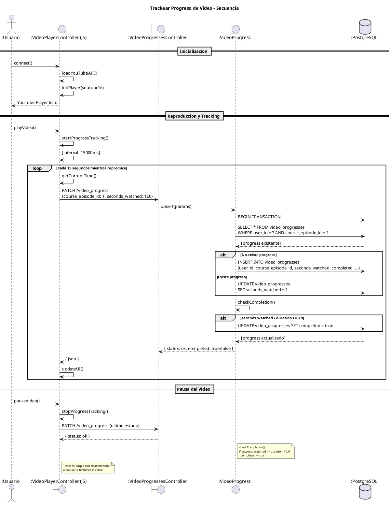

# Diagrama de Casos de Uso Narrativo

## Caso de Uso: Agregar Herramienta a Favoritos

**Actor:** Usuario Registrado

**Objetivo:** Guardar una herramienta en la lista de favoritos personal

**Precondiciones:**
- Usuario debe estar autenticado
- Herramienta debe existir en el sistema

**Flujo Básico:**

| Paso | Actor | Sistema |
|------|-------|---------|
| 1 | Usuario navega a detalle de herramienta | - |
| 2 | - | Muestra informacion de herramienta con boton "Agregar a Favoritos" |
| 3 | Usuario presiona boton "Agregar a Favoritos" | - |
| 4 | - | Verifica que el usuario este autenticado |
| 5 | - | Verifica que la herramienta no este ya en favoritos |
| 6 | - | Crea registro en FavoriteTool |
| 7 | - | Confirma con mensaje "Herramienta agregada a favoritos" |

**Flujo Alternativo:**

| Paso | Condicion | Accion |
|------|-----------|--------|
| 4a | Usuario no autenticado | Redirige a pagina de login |
| 5a | Herramienta ya en favoritos | Muestra error "ya esta en tus favoritos" |

**Postcondiciones:**
- Registro FavoriteTool creado con user_id y tool_id
- Herramienta visible en /mis-favoritos

### Diagrama de Secuencia

---

## Caso de Uso: Quitar Herramienta de Favoritos

**Actor:** Usuario Registrado

**Objetivo:** Eliminar una herramienta de la lista de favoritos

**Precondiciones:**
- Usuario debe estar autenticado
- Herramienta debe estar en favoritos del usuario

**Flujo Básico:**

| Paso | Actor | Sistema |
|------|-------|---------|
| 1 | Usuario navega a /mis-favoritos | - |
| 2 | - | Lista herramientas y cursos favoritos |
| 3 | Usuario presiona boton "Eliminar" en herramienta | - |
| 4 | - | Busca FavoriteTool por id |
| 5 | - | Elimina registro de FavoriteTool |
| 6 | - | Confirma con mensaje "Herramienta eliminada de favoritos" |

**Postcondiciones:**
- Registro FavoriteTool eliminado
- Herramienta ya no aparece en /mis-favoritos

### Diagrama de Secuencia

---

## Caso de Uso: Trackear Progreso de Video

**Actor:** Usuario Registrado

**Objetivo:** Guardar el progreso de visualizacion de un video

**Precondiciones:**
- Usuario debe estar autenticado
- Episodio de curso debe existir
- Video debe estar en reproduccion

**Flujo Básico:**

| Paso | Actor | Sistema |
|------|-------|---------|
| 1 | Usuario selecciona episodio de curso | - |
| 2 | - | Inicializa reproductor YouTube |
| 3 | Usuario presiona "Play" | - |
| 4 | - | Inicia timer cada 15 segundos |
| 5 | - | Obtiene tiempo actual del reproductor |
| 6 | - | Envia PATCH /video_progress con segundos |
| 7 | - | Busca o crea VideoProgress |
| 8 | - | Actualiza seconds_watched |
| 9 | - | Verifica si >= 90% de duracion |
| 10 | - | Si si, marca completed = true |
| 11 | - | Confirma guardado |

**Flujo Alternativo:**

| Paso | Condicion | Accion |
|------|-----------|--------|
| 9a | seconds_watched < 90% | completed permanece false |
| 10 | Video terminado | Detiene timer, guarda progreso final |

**Postcondiciones:**
- VideoProgress actualizado con segundos vistos
- Si >= 90%, video marcado como completado
- Progreso visible en UI de episodios

### Diagrama de Secuencia

---

## Caso de Uso: Gestionar Categorias (Admin)

**Actor:** Administrador

**Objetivo:** Mantener el catalogo de categorias

**Precondiciones:**
- Usuario debe tener rol admin = true

**Flujo Básico:**

| Paso | Actor | Sistema |
|------|-------|---------|
| 1 | Admin accede a /admin/categories | - |
| 2 | - | Lista todas las categorias |
| 3 | Admin presiona "Nueva Categoria" | - |
| 4 | Admin completa: nombre, descripcion | - |
| 5 | Admin presiona "Guardar" | - |
| 6 | - | Genera slug desde nombre |
| 7 | - | Valida campos requeridos |
| 8 | - | Crea Category en base de datos |
| 9 | - | Confirma con mensaje |

**Flujo de Edicion:**

| Paso | Actor | Sistema |
|------|-------|---------|
| 1 | Admin presiona "Editar" en categoria | - |
| 2 | - | Muestra formulario con datos actuales |
| 3 | Admin modifica campos | - |
| 4 | Admin presiona "Actualizar" | - |
| 5 | - | Actualiza Category |
| 6 | - | Confirma con mensaje |

**Flujo de Eliminacion:**

| Paso | Actor | Sistema |
|------|-------|---------|
| 1 | Admin presiona "Eliminar" | - |
| 2 | - | Verifica si hay herramientas asociadas |
| 3a | Hay herramientas | Muestra error, no permite eliminar |
| 3b | No hay herramientas | Elimina Category |
| 4 | - | Confirma con mensaje |

---

## Caso de Uso: Gestionar Herramientas (Admin)

**Actor:** Administrador

**Objetivo:** Mantener el catalogo de herramientas

**Precondiciones:**
- Usuario debe tener rol admin = true
- Categorias deben existir

**Flujo Básico:**

| Paso | Actor | Sistema |
|------|-------|---------|
| 1 | Admin accede a /admin/tools/new | - |
| 2 | Admin completa formulario | - |
| 3 | Admin sube logo (opcional) | - |
| 4 | Admin presiona "Crear Herramienta" | - |
| 5 | - | Valida campos requeridos |
| 6 | - | Genera slug desde nombre |
| 7 | - | Almacena logo en Active Storage |
| 8 | - | Crea Tool en base de datos |
| 9 | - | Confirma con mensaje |

**Flujo de Eliminacion (CASCADE):**

| Paso | Actor | Sistema |
|------|-------|---------|
| 1 | Admin presiona "Eliminar" | - |
| 2 | - | Elimina FavoriteTools asociados |
| 3 | - | Elimina ContactMessages asociados |
| 4 | - | Elimina FeaturedItems asociados |
| 5 | - | Elimina registro de Tool |
| 6 | - | Elimina logo de Active Storage |

---

## Requerimientos Asociados

| Caso de Uso | Requerimientos |
|-------------|----------------|
| Agregar Favorito | RF-FAV-01, RF-FAV-05 |
| Quitar Favorito | RF-FAV-02, RF-FAV-04 |
| Trackear Progreso | RF-PROG-01, RF-PROG-02 |
| Marcar Completado | RF-PROG-03 |
| Gestionar Categorias | RF-CAT-01, RF-CAT-02, RF-CAT-03, RF-CAT-04 |
| Gestionar Herramientas | RF-TOOL-01, RF-TOOL-02, RF-TOOL-07, RF-TOOL-10 |
