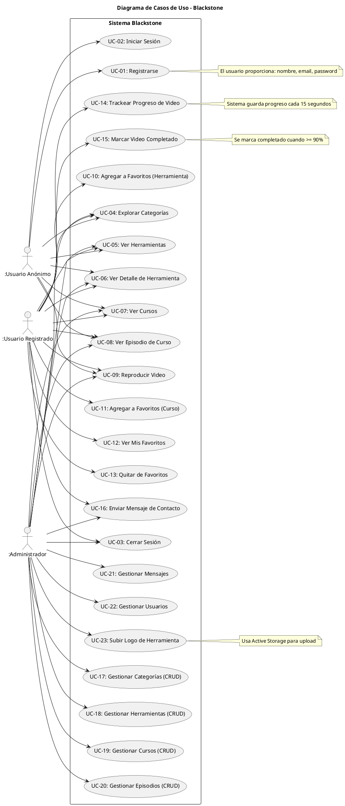

# Diagrama de Casos de Uso

## Actores

| Actor | Descripción | Permisos |
|-------|-------------|----------|
| **Usuario Anónimo** | Visitante sin cuenta | Ver contenido público, explorar categorías y herramientas |
| **Usuario Registrado** | Cuenta con email/password | Favoritos, progreso de video, contacto |
| **Administrador** | Cuenta con admin=true | CRUD completo, gestión de usuarios y mensajes |

## Casos de Uso por Paquete

### Autenticación
- UC-01: Registrarse
- UC-02: Iniciar Sesión
- UC-03: Cerrar Sesión

### Contenido Público
- UC-04: Explorar Categorías
- UC-05: Ver Herramientas
- UC-06: Ver Detalle de Herramienta
- UC-07: Ver Cursos
- UC-08: Ver Episodio de Curso
- UC-09: Reproducir Video

### Favoritos y Progreso
- UC-10: Agregar a Favoritos (Herramienta)
- UC-11: Agregar a Favoritos (Curso)
- UC-12: Ver Mis Favoritos
- UC-13: Quitar de Favoritos
- UC-14: Trackear Progreso de Video
- UC-15: Marcar Video Completado

### Contacto
- UC-16: Enviar Mensaje de Contacto

### Administración
- UC-17: Gestionar Categorías (CRUD)
- UC-18: Gestionar Herramientas (CRUD)
- UC-19: Gestionar Cursos (CRUD)
- UC-20: Gestionar Episodios (CRUD)
- UC-21: Gestionar Mensajes
- UC-22: Gestionar Usuarios
- UC-23: Subir Logo de Herramienta
