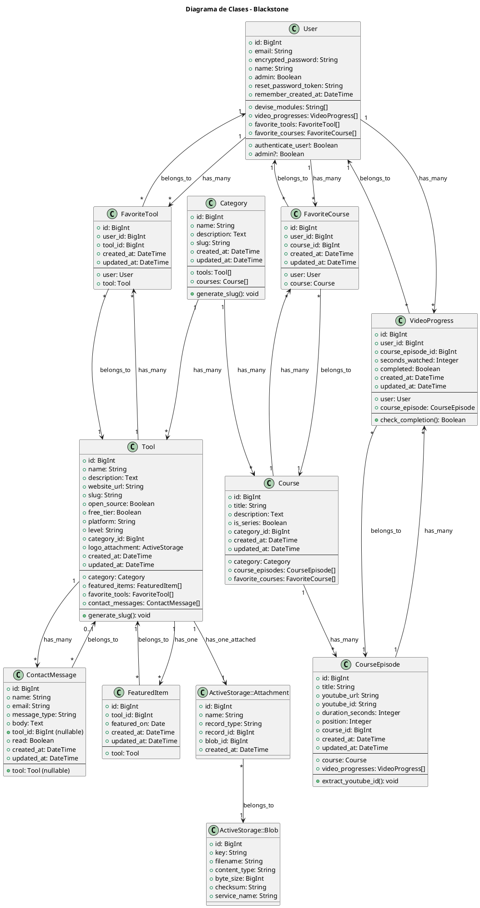

# Diagrama de Clases



## Modelo de Dominio

### Entidades Principales

| Entidad | Descripción | Relaciones |
|---------|-------------|------------|
| **User** | Usuario del sistema | has_many :video_progresses, :favorite_tools, :favorite_courses |
| **Category** | Categoría de herramientas/cursos | has_many :tools, :courses |
| **Tool** | Herramienta de desarrollo | belongs_to :category, has_many :favorite_tools |
| **Course** | Curso en video | belongs_to :category, has_many :course_episodes |
| **CourseEpisode** | Episodio individual de curso | belongs_to :course, has_many :video_progresses |
| **VideoProgress** | Tracking de progreso | belongs_to :user, :course_episode |

### Entidades de Favoritos

| Entidad | Descripción | Llave única |
|---------|-------------|-------------|
| **FavoriteTool** | Herramienta favoriteda | [user_id, tool_id] |
| **FavoriteCourse** | Curso favoritedo | [user_id, course_id] |

### Entidades de Soporte

| Entidad | Descripción |
|---------|-------------|
| **FeaturedItem** | Herramienta destacada del día |
| **ContactMessage** | Mensaje de contacto de usuario |
| **ActiveStorage::Attachment** | Archivo adjunts (logos) |

## Constantes del Modelo

```ruby
class Tool < ApplicationRecord
  PLATFORMS = ["Web", "Windows", "Mac", "Linux", "Multiplataforma"]
  LEVELS = ["Principiante", "Normal", "Intermedio", "Avanzado", "Cualquiera"]
end

class ContactMessage < ApplicationRecord
  MESSAGE_TYPES = ["sugerencia", "reclamo", "link_roto", "otro"]
end
```
