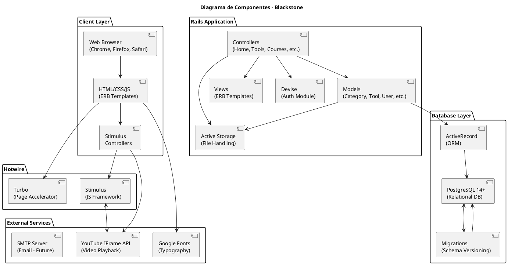

# Diagrama de Componentes

## Arquitectura de Componentes

### Client Layer (Navegador)
| Componente | Descripción |
|-----------|-------------|
| **Web Browser** | Chrome, Firefox, Safari |
| **HTML/CSS/JS** | Templates ERB renderizados por Rails |
| **Stimulus Controllers** | Video player, Modal |

### Rails Application
| Componente | Descripción |
|-----------|-------------|
| **Controllers** | Home, Tools, Courses, Admin, etc. |
| **Models** | Category, Tool, User, Course, etc. |
| **Views** | Plantillas ERB |
| **Devise** | Autenticación |
| **Active Storage** | Gestión de archivos (logos) |

### Hotwire
| Componente | Descripción |
|-----------|-------------|
| **Turbo** | Acelerador de páginas (SPA-like) |
| **Stimulus** | Framework JavaScript ligero |

### Database Layer
| Componente | Descripción |
|-----------|-------------|
| **PostgreSQL 14+** | Base de datos relacional |
| **Migrations** | Versionado del schema |
| **ActiveRecord** | ORM de Rails |

### External Services
| Componente | Descripción |
|-----------|-------------|
| **YouTube IFrame API** | Reproductor de video |
| **Google Fonts** | Inter, DM Serif Display, JetBrains Mono |
| **SMTP Server** | Futuro: notificaciones email |
