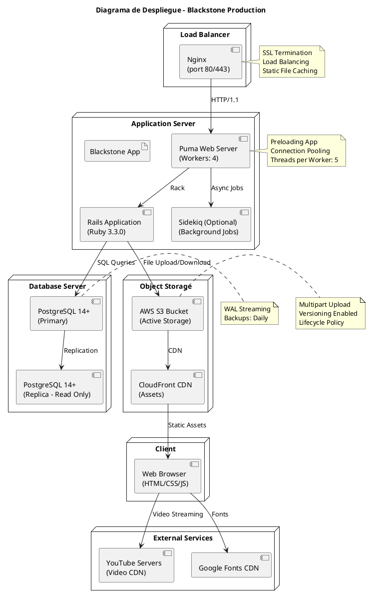

# Diagrama de Despliegue



## Infraestructura de Producción

### Load Balancer (Nginx)
- SSL Termination
- Load Balancing (round-robin)
- Static File Caching
- Puerto 80/443

### Application Server
| Componente | Configuración |
|-----------|---------------|
| **Puma Web Server** | Workers: 4, Threads: 5 |
| **Rails Application** | Ruby 3.3.0, Rails 7.1.3 |
| **Sidekiq (Opcional)** | Background jobs |

### Database Server
| Componente | Función |
|-----------|---------|
| **PostgreSQL Primary** | Escrituras y lecturas principales |
| **PostgreSQL Replica** | Lecturas (read replica) |

### Object Storage
| Componente | Función |
|-----------|---------|
| **AWS S3 Bucket** | Active Storage para logos y archivos |
| **CloudFront CDN** | Distribución de assets estáticos |

### External Services
| Servicio | Uso |
|----------|-----|
| **YouTube Servers** | Streaming de videos de cursos |
| **Google Fonts CDN** | Tipografía (Inter, DM Serif Display, JetBrains Mono) |

## Comunicación Entre Componentes

| De | A | Protocolo |
|----|---|-----------|
| Browser | Nginx | HTTPS |
| Nginx | Puma | HTTP/1.1 |
| Rails | PostgreSQL | SQL (TCP) |
| Rails | S3 | HTTPS |
| S3 | CloudFront | Internal |
| Browser | YouTube | HTTPS |

## Configuración Recomendada

### Nginx
```nginx
upstream blackstone {
  server 127.0.0.1:3000;
}

server {
  listen 443 ssl;
  ssl_certificate /path/to/cert.pem;
  ssl_certificate_key /path/to/key.pem;

  location / {
    proxy_pass http://blackstone;
  }
}
```

### Puma
```ruby
workers 4
threads 5
```

### PostgreSQL
```sql
-- Indexes para performance
CREATE INDEX idx_video_progress_user_episode
ON video_progresses (user_id, course_episode_id);
```
