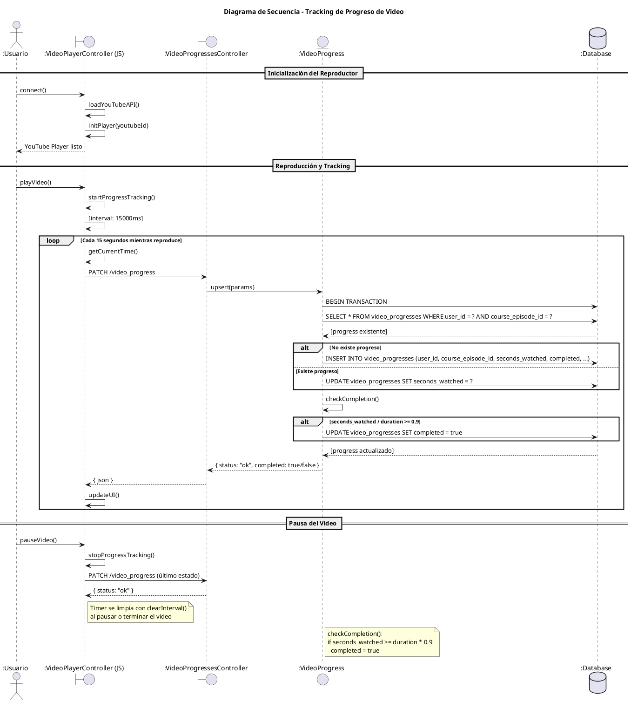

# Diagrama de Secuencia - Tracking de Progreso de Video



## Descripción del Flujo

### Inicialización
1. Stimulus controller se conecta al DOM
2. Carga YouTube IFrame API
3. Inicializa el reproductor con el `youtube_id`

### Tracking Automático
1. Cada **15 segundos** mientras el video reproduce:
   - Obtiene tiempo actual (`getCurrentTime()`)
   - Envía PATCH al servidor con segundos
2. Servidor busca o crea `VideoProgress`
3. Verifica completion (>= 90%)

### Completion
Cuando `seconds_watched / duration >= 0.9`:
- `completed` se marca como `true`
- UI se actualiza para mostrar checkmark

## Parámetros del Endpoint

```json
PATCH /video_progress
{
  "course_episode_id": 1,
  "seconds_watched": 120
}
```

## Respuesta del Servidor

```json
{
  "status": "ok",
  "data": {
    "id": 1,
    "course_episode_id": 1,
    "seconds_watched": 120,
    "completed": false,
    "duration_seconds": 600
  }
}
```
