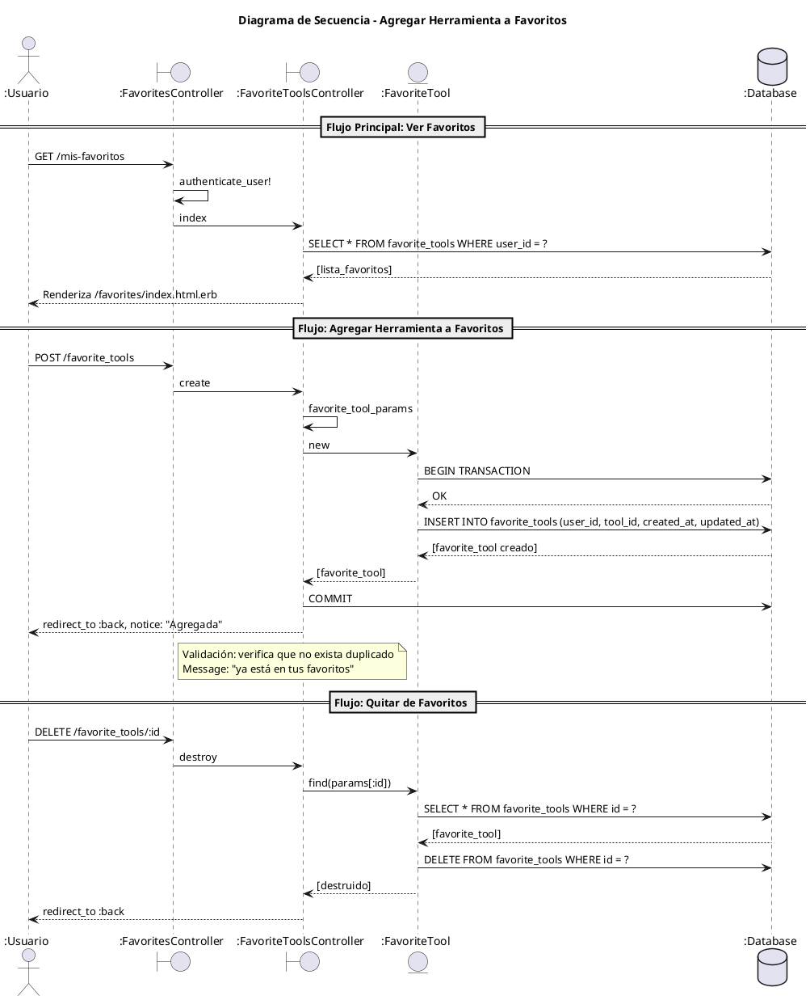

# Diagrama de Secuencia - Sistema de Favoritos

## Descripción del Flujo

### 1. Ver Favoritos
El usuario autenticado accede a `/mis-favoritos`. El sistema verifica su sesión, consulta los favoritos del usuario y los muestra.

### 2. Agregar a Favoritos
1. Usuario presiona "Agregar a Favoritos" en una herramienta
2. Sistema crea registro `FavoriteTool` con `user_id` y `tool_id`
3. Validación: no permite duplicados (unique scope)

### 3. Quitar de Favoritos
1. Usuario presiona "Eliminar" en `/mis-favoritos`
2. Sistema busca y elimina el registro `FavoriteTool`

## Escenarios Alternativos

| Escenario | Condición | Resultado |
|-----------|----------|-----------|
| Usuario no autenticado | Intentando agregar | Redirige a login |
| Duplicado | Herramienta ya en favoritos | Muestra mensaje de error |
| Registro no existe | ID inválido al eliminar | Error 404 |
